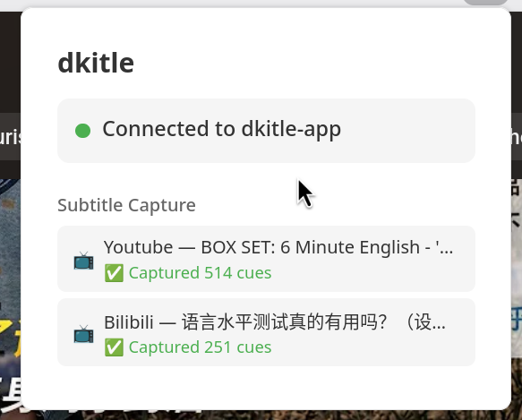
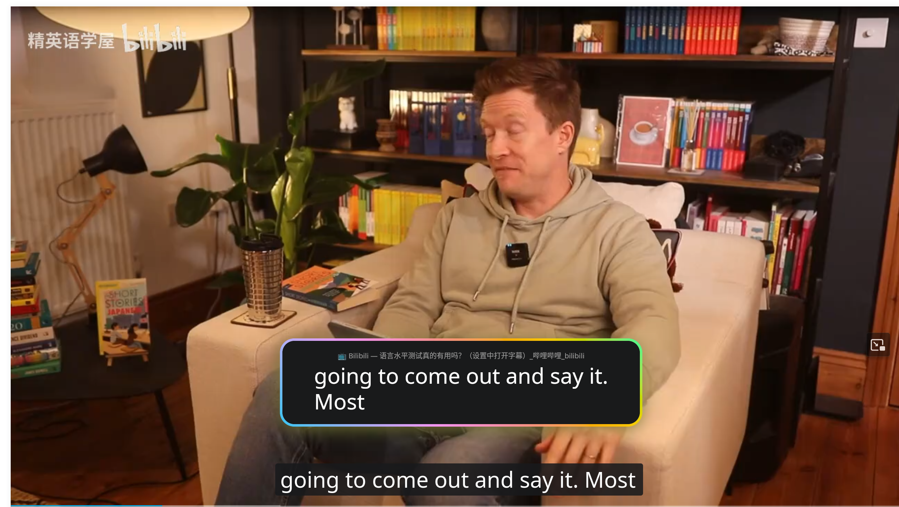

# dkitle

[English](README.md)

将浏览器中的视频字幕同步显示在桌面置顶窗口中。

**支持站点：** YouTube、Bilibili

**支持平台：** Windows、Linux（X11/Wayland）、macOS

## 截图

|            主窗口             |             Chrome              |
| :---------------------------: | :-----------------------------: |
|  |  |

|            YouTube 字幕同步            |               Bilibili 视频               |               Bilibili 字幕同步               |
| :------------------------------------: | :---------------------------------------: | :-------------------------------------------: |
|  |  |  |

## 使用方法

### 1. 启动桌面应用

从 [GitHub Releases](https://github.com/ywxt/dkitle/releases) 下载最新版本，或从源码构建（见下方）。

应用启动后会：

- 在 `ws://localhost:9877/ws` 开启 WebSocket 服务器
- 显示一个管理窗口，列出所有字幕来源

### 2. 安装油猴脚本

1. 在浏览器中安装 [Tampermonkey](https://www.tampermonkey.net/) 或 [Violentmonkey](https://violentmonkey.github.io/)
2. [点击此处安装 dkitle.user.js](https://greasyfork.org/en/scripts/568843-dkitle-subtitle-sync)
3. 在脚本管理器中确认安装

> 油猴脚本支持所有浏览器（Chrome、Firefox、Edge、Safari），无需商店审核。

### 3. 使用

1. 确保 dkitle-app 正在运行
2. 打开 YouTube 或 Bilibili 视频并开启字幕
3. 字幕会自动同步显示在桌面置顶窗口中
4. 字幕窗口可自由调整大小，字体会根据窗口尺寸自动适应

### 窗口管理器配置（Linux）

#### 窗口标识

| 窗口     | `app_id`（Wayland）           | 说明                 |
| -------- | ----------------------------- | -------------------- |
| 管理窗口 | `org.eu.ywxt.dkitle`          | 主窗口，列出字幕来源 |
| 字幕窗口 | `org.eu.ywxt.dkitle.subtitle` | 置顶字幕叠加窗口     |

#### Wayland 平铺窗口管理器

在 Wayland 平铺窗口管理器（如 Sway、Hyprland）中，字幕窗口默认只会在当前工作区显示，且可能被平铺管理。使用 `app_id` `org.eu.ywxt.dkitle.subtitle` 添加窗口规则实现浮动 + 置顶。

**Sway**（`~/.config/sway/config`）：

```
for_window [app_id="org.eu.ywxt.dkitle.subtitle"] floating enable, sticky enable
```

**Hyprland**（`~/.config/hypr/hyprland.conf`）：

```
windowrulev2 = float, class:^(org\.eu\.ywxt\.dkitle\.subtitle)$
windowrulev2 = pin, class:^(org\.eu\.ywxt\.dkitle\.subtitle)$
```

**i3（X11）**（`~/.config/i3/config`）：

```
for_window [class="org.eu.ywxt.dkitle.subtitle"] floating enable, sticky enable
```

其他窗口管理器请参考相应文档，使用 `app_id`（Wayland）或 WM_CLASS（X11）匹配字幕窗口 `org.eu.ywxt.dkitle.subtitle`，并设置为浮动 + 固定（sticky/pin）。

## 从源码构建

### 系统要求

- **Rust**（最新稳定版）
- **Python 3.6+**（用于图标生成和打包，仅使用标准库）
- [iced](https://github.com/iced-rs/iced) 所需的平台依赖

### 构建

```bash
cd dkitle-app
cargo build --release
# 输出：dkitle-app/target/release/dkitle-app
```

或直接运行：

```bash
cd dkitle-app
cargo run
```

### 打包发布

```bash
# 生成图标（首次构建前需要）
python scripts/generate_icons.py

# 为当前平台打包
python build.py package

# 为指定目标平台打包
python build.py package --target x86_64-unknown-linux-gnu
```

## 项目结构

```text
dkitle/
├── dkitle.user.js           # 油猴脚本 — 字幕拦截与同步（Tampermonkey/Violentmonkey）
├── build.py                 # 桌面应用打包脚本（跨平台，Python 3）
├── build.sh                 # 构建脚本（Linux/macOS）
├── build.bat                # 构建脚本（Windows）
├── scripts/
│   └── generate_icons.py    # 图标生成（PNG、ICO、ICNS）
│
└── dkitle-app/              # Rust 桌面应用 — 接收并置顶显示字幕
    ├── Cargo.toml
    ├── build.rs
    ├── assets/
    │   ├── icon.png
    │   ├── icon.ico
    │   ├── dkitle.desktop
    │   └── macos/
    │       ├── Info.plist
    │       └── AppIcon.icns
    └── src/
        ├── main.rs          # 入口
        ├── server.rs        # WebSocket 服务器（端口 9877）
        ├── subtitle.rs      # 字幕数据模型
        └── ui.rs            # iced 置顶字幕窗口
```

## 添加新的字幕站点

编辑 `dkitle.user.js` 即可添加新站点支持：

1. 在脚本头部添加 `@match` 规则
2. 在 `SITES` 数组中添加新条目：
   - `name` — 站点标识
   - `urlMatch` — 匹配视频页面 URL 的正则（用于注册视频同步）
   - `interceptUrlTest` — 匹配字幕 API URL 的函数
   - `parseResponse` — 解析字幕数据为 `{ start_ms, end_ms, text }` 格式的函数
3. 在 `detectSite()` 函数中添加主机名检测
